# 🚀 ClickPe Smart Assistant: AI Co-Pilot for FinTech Ops

A Production-Grade Hybrid AI System for Loan Underwriting, Daily Cashflow Planning, and Failure Forensics.
video link -: https://drive.google.com/file/d/1YWd1MJJhYsW4ZDz4qJsM-_1OzzCF1TTE/view?usp=sharing

---

## 💡 The Inspiration: Why this exists?

ClickPe operates on a unique lending model: **"Daily Deductions" (EDI)**. Instead of one massive monthly EMI, merchants pay a small amount daily. While this reduces burden, it creates two massive operational headaches:

### The Merchant's Dilemma
> "How much cash should I leave in my wallet today so my auto-debit doesn't bounce?" (leading to accidental defaults).

### The Ops Team's Nightmare
> "Why did Transaction #TXN_998 fail? Was it insufficient funds? A server timeout? Or an expired mandate?" (leading to hours of manual log checking).

### The Solution
**ClickPe Smart Assistant** is not just a chatbot. It is a **Full-Stack Financial Intelligence System** that ingests real transaction logs, performs deterministic math for risk assessment, and uses Generative AI to explain complex policies.

---

## 🏗️ System Architecture (The "Hybrid" Brain)

Unlike basic RAG wrappers, this system uses a **Router-Based Agentic Workflow** (built with LangGraph). It intelligently switches between **Deterministic Logic** (for Money/Math) and **Generative AI** (for Explanations).

### Architecture Diagram


> 📊 [View Interactive Diagram on Eraser.io](https://app.eraser.io/workspace/2v0BXoqatrm7pU16EPeM?origin=share)

```mermaid
graph TD
    User[User / Merchant] -->|Query| API[FastAPI Backend]
    API --> Router{🤖 Intent Router}
    
    %% Deterministic Paths (100% Accuracy)
    Router -->|'I want a loan'| Math[🧮 Loan Engine]
    Router -->|'How much to save?'| Plan[📉 Savings Planner]
    
    %% RAG Path (Context Aware)
    Router -->|'Why did it fail?'| Detective[🕵️ Ops Detective]
    
    %% Data Sources
    Math -->|Read Sales| DB[(Supabase Transactions)]
    Plan -->|Read History| DB
    Detective -->|Read Error Logs| Logs[(Supabase Logs)]
    
    %% Output
    Math & Plan & Detective --> Response[Final Response]
    Response -->|Persist| Memory[Chat Memory Table]
```



### 🧠 Why Hybrid?

- **Money needs Math, not AI**: An LLM might hallucinate that 5000/30 is 200. My system uses Python logic for financial calculations to ensure 100% accuracy.
- **Forensics needs Context**: An LLM is perfect for reading JSON error logs (`{"error": "insufficient_funds"}`) and translating them into human advice ("Please top up your wallet").

---

## ✨ Key Features

### 1. 📉 The "Daily Savings" Planner (Merchant Focus)

**The Problem**: Merchants don't know their daily average.

**The Logic**: The bot ingests the merchant's CSV, calculates the Average Daily Sales (ADS) over the last 30 days, and applies the **20% Safety Rule**.

**Output**: *"Your avg sale is ₹1,743. Please set aside ₹348 today to ensure your EMI goes through."*

### 2. 🏦 Automated Loan Underwriting (Risk Engine)

**The Problem**: Manual underwriting is slow.

**The Logic**: A deterministic "Pre-Check" engine that evaluates:
- **Coverage Ratio**: (Avg Daily Income / Daily EMI)
- **On-Time Repayment Rate**: (Success Logs / Total Attempts)
- **Wallet Health**: Current Balance vs EMI

**Output**: A strict ✅ **Eligible** or ❌ **Not Eligible** verdict with specific reasons (e.g., *"Rejected due to low On-Time Rate: 75%"*).

### 3. 🕵️‍♂️ Ops Co-Pilot (Internal Tool)

**The Problem**: Debugging failed transactions requires SQL knowledge.

**The Logic**: Structured RAG (Retrieval Augmented Generation). The bot queries the `transaction_logs` SQL table for specific failure codes.

**Output**: Explains technical errors in plain English.

---

## 🛠️ Tech Stack & Decisions

| Component | Technology | Why I Chose It? |
|-----------|------------|-----------------|
| **Backend** | FastAPI (Python) | High-performance, async support, and native Pydantic integration for data validation. |
| **Database** | Supabase (PostgreSQL) | Combines SQL (for transaction logs) and Vectors (for documents) in one cloud platform. |
| **Orchestrator** | LangGraph | To build a stateful "State Machine" rather than a linear chain. Allows for looping and conditional routing. |
| **Frontend** | HTML5 + Tailwind | Lightweight, responsive dashboard without the overhead of React/Next.js for this MVP. |
| **AI Model** | Gemini 1.5 Flash | Fast inference speed and large context window for analyzing logs. |

---

## 📂 Project Structure

A clean, modular structure designed for scalability.

```
CLICKPE-SMART-ASSISTANT/
├── ai_engine.py          # 🧠 The Brain: LangGraph, Router, and Tool Logic
├── main.py               # 🔌 The Server: FastAPI Endpoints & CSV Processing
├── make_sample_csv.py    # 🛠️ Utility: Generates synthetic financial data
├── requirements.txt      # 📦 Dependencies
├── .env                  # 🔑 Secrets (Supabase/Google Keys)
├── static/               # 🎨 Assets (Logos, CSS)
├── templates/            
│   └── index.html        # 🖥️ Frontend: Dashboard & Chat UI
└── sample_data/          # 📊 Test Data for Mentors/Recruiters
```

---

## 🚀 How to Run Locally

### 1. Clone the Repository

```bash
git clone https://github.com/yourusername/clickpe-smart-assistant.git
cd clickpe-smart-assistant
```

### 2. Install Dependencies

```bash
pip install -r requirements.txt
```

### 3. Set up Environment Variables

Create a `.env` file in the root directory:

```env
SUPABASE_URL="your_supabase_url"
SUPABASE_KEY="your_supabase_anon_key"
GOOGLE_API_KEY="your_gemini_key"
USE_LLM="1"
```

### 4. Run the Server

```bash
uvicorn main:app --reload
```

Visit `http://localhost:8000` to access the Ops Dashboard.

---

## 🧪 Demo Scenarios (Try these!)

1. **Upload Data**: Upload the provided `sample_data/sample_txn_merchant_1.csv`.
   - **Result**: System calculates Average Daily Sales immediately.

2. **Ask for Savings**: Type *"How much should I save today?"*
   - **Result**: Bot calculates ~20% of your CSV average.

3. **Apply for Loan**: Type *"I want a loan of 50,000 for 6 months."*
   - **Result**: Bot runs the eligibility math engine.

4. **Debug Failure**: Type *"Why did the last transaction fail?"*
   - **Result**: Bot fetches the exact error reason from the SQL logs.

---

## 🔮 Future Improvements

- **Predictive Analysis**: Move from "Average Sales" to "Time-Series Forecasting" for better accuracy.
- **WhatsApp Integration**: Deploy the "Ops Co-Pilot" on WhatsApp for field agents.

---

## 🤝 Contributing

Contributions are welcome! Please feel free to submit a Pull Request.

---

## 📄 License

This project is licensed under the MIT License.

---

**Built with ❤️ for the ClickPe Engineering Assignment.**
